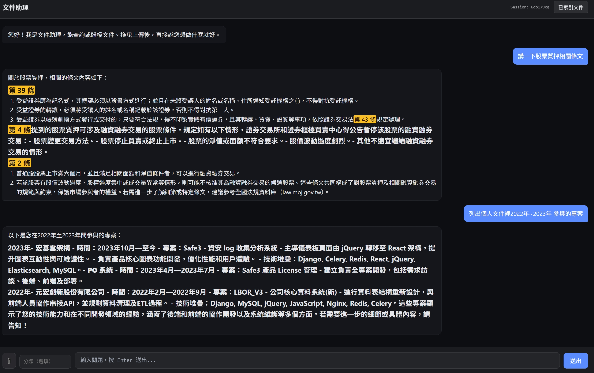
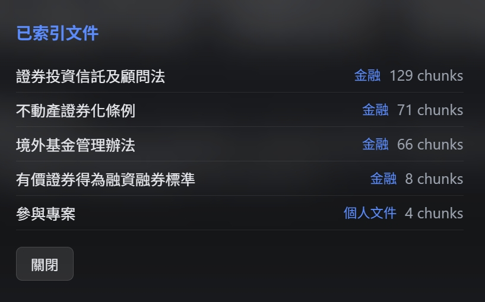

# DocOrganize — AI 文件助理

儲存個人文件並且利用RAG搜尋文件內容，並精確回答。

## 使用範例

## 功能

- **多輪工具呼叫的 Agent**：不用手動切換模式，用自然語言描述需求（「幫我查XX規定」「把這份存起來」「比較這兩份文件」），Agent 自己判斷該呼叫哪個工具
- **文件歸檔與比較**：拖曳上傳文件後，可要求 Agent 寫入知識庫長期保存，或唯讀比較多份文件的內容差異
- **AI 雙重審核**：關鍵操作與回答品質皆有獨立的第二顆 LLM 交叉複核，降低誤判與答非所問的風險
- **跨文件類型知識庫**：不侷限法規，可依分類或指定文件縮小搜尋範圍
- **Multi-Query RAG-Fusion**：同一問題改寫成多個角度的 query，各自檢索後 RRF 合併，提升口語問法的召回率
- **混合檢索**：Elasticsearch BM25 + kNN + RRF fusion，兼顧關鍵字命中與語意相似
- **HyDE**：先讓 LLM 生成假設條文再 embed，縮短白話問法與專業用詞的語意鴻溝
- **語意嵌入**：BAAI/bge-m3 本地模型，無需外部 Embedding API
- **對話記憶**：每個 session 儲存最近對話歷史，支援多輪追問
- **串流輸出**：SSE 即時逐 token 推送，回答邊生成邊顯示
- **動態 LLM fallback**：主 LLM 額度耗盡時自動切換備援，保持服務可用

## 技術

| 層 | 技術 |
|----|------|
| LLM | OpenAI gpt-4o-mini（+ Gemini 備援）|
| Agent | OpenAI Function Calling（原生，多輪工具呼叫）|
| Embedding | BAAI/bge-m3（本地，1024 dim）|
| 向量 / 全文 DB | Elasticsearch 8.x（BM25 + kNN + RRF）|
| 對話記憶 | Redis 7 |
| API | FastAPI + sse-starlette |
| 前端 | 純 HTML/CSS/JS + marked.js |
| 部署 | Docker Compose |

## 設計決策

- **原生 Function Calling 取代框架**：直接使用 OpenAI SDK 的 tool use 流程，保留對 streaming、tool 執行順序的完整控制
- **Agent 自主判斷，而非固定流程**：使用者不用手動選功能，Agent 依對話內容自己決定要查詢、歸檔
- **雙層 LLM 審核**：寫入類操作與回答品質皆由另一顆 LLM 獨立覆核，避免單一模型的盲點
- **Multi-Query RAG-Fusion**：GPT 將問題改寫為多個不同角度，批次 embed 後各自 BM25+kNN，再做第二層 RRF；有效覆蓋使用者口語問法與專業術語之間的差距
- **HyDE**：kNN 用假設條文 embed，BM25 仍用原始 query，兩者 RRF 合併，兼顧召回率與精準度
- **手動 RRF**：ES basic license 不支援內建 RRF pipeline，以 Python 實作兩次查詢 + reciprocal rank fusion
- **本地 Embedding**：bge-m3 在本機推理，避免每次查詢呼叫外部 API 產生延遲與費用
